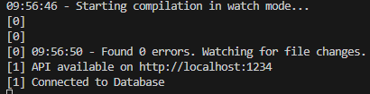

# RevoU Week 9 Assignment

Creates simple financial tracker API using ExpresJS & Typescript, also connects it with MySQL database and Redis for caching.

## Assignment Information

1. Back-end is written using Typescript, ExpressJS, and NodeJS.

2. Back-end and Database is deployed at Railway.app.

3. Database used is MySQL and Redis (for caching)

## Advanced Information - Back-End

1. There's no Authentication, so you can use it as is.

2. If user accessed invalid API Endpoint, it will be blocked and instead return HTTP 404.

3. After any query, database connection is closed using mysql.end() function.

4. Back-end will check if data exist on Redis before querying to the MySQL Database.
   
   1. If data exist, then it returns data obtained from Redis.
   
   2. Else, it will query from MySQL, save it to Redis, and returns data.
   
   3. Redis data will persist for 1 minute.

5. When connection successfully established, it will be shown on Console.
   
   

## API Endpoint

Base URL : adriantori-w9-be.up.railway.app/

| HTTP Request | URL Endpoint                                    | Explanation                          |
|:------------:|:----------------------------------------------- | ------------------------------------ |
| GET          | /                                               | Hello World                          |
| GET          | /user/:id                                       | Return user info                     |
| POST         | /transaction/                                   | Post new transaction                 |
| PUT          | /transaction/:id                                | Update transaction by transaction ID |
| DELETE       | adriantori-w9-be.up.railway.app/transaction/:id | Delete transaction by transaction ID |
| GET          | /transaction                                    | Get all transactions data            |
| GET          | /users                                          | Get all users data                   |
| GET          | /* (unhandled endpoint)                         | Return 404 page not found            |

## API Request and Response

### GET /user:id

Response:

```json
{
    "id": <user ID>,
    "name": <user Name>,
    "address": <user Address,
    "balance": <total Transaction income - expense>,
    "expense": <total Transaction expense>
}
```

### POST /transaction

Request:

```json
{
    "type": <"income" / "expense">,
    "amount": <integer>,
    "user_id": <integer, same as existing User id>
}
```

Response:

```json
{
    "id": <Transaction id of newly created data>
}
```

### PUT /transaction/:id

Request:

```json
{
    "type": <"income" / "expense">,
    "amount": <integer>,
    "user_id": <integer, same as existing User id>
}
```

Response:

```json
{
    "id": <Transaction id of updated data>
}
```

### DELETE /transaction/:id

Response:

```json
{
    "id": <Transaction id of deleted data>
}
```

## Advanced Information - Database

in this section, I will explain about Table definition, how to use it, and how Redis works.

### MySQL Database Table Definition:

#### User table

| id      | int          |
| ------- | ------------ |
| name    | VARCHAR(70)  |
| address | VARCHAR(100) |

#### Create User table

```sql
CREATE TABLE `user` (
  `id` int NOT NULL AUTO_INCREMENT,
  `name` varchar(70) NOT NULL,
  `address` varchar(100) DEFAULT NULL,
  PRIMARY KEY (`id`)
) ENGINE=InnoDB AUTO_INCREMENT=0 DEFAULT CHARSET=utf8mb4 COLLATE=utf8mb4_0900_ai_ci;
```

#### Transaction table

| id      | int        |
| ------- | ---------- |
| user_id | int        |
| type    | VARCHAR(8) |
| amount  | DOUBLE     |

#### Create Transaction table

```sql
CREATE TABLE `transaction` (
  `id` int NOT NULL AUTO_INCREMENT,
  `user_id` int NOT NULL,
  `type` varchar(8) NOT NULL,
  `amount` double NOT NULL,
  PRIMARY KEY (`id`),
  KEY `transaction_FK` (`user_id`),
  CONSTRAINT `transaction_FK` FOREIGN KEY (`user_id`) REFERENCES `user` (`id`)
) ENGINE=InnoDB AUTO_INCREMENT=0 DEFAULT CHARSET=utf8mb4 COLLATE=utf8mb4_0900_ai_ci;
```

### MySQL Import Initial Data

#### User data

```sql
INSERT INTO `user` (name,address) VALUES
	 ('admin','surabaya'),
	 ('toni','bekasi');
```

### MySQL Initial Data : import query transaction

#### Transaction data

```sql
INSERT INTO `transaction` (user_id,`type`,amount) VALUES
	 (2,'income',200000.0),
	 (1,'income',250000.0),
	 (2,'expense',250000.0),
	 (1,'income',100000.0),
	 (1,'income',60000.0),
	 (1,'expense',50000.0),
	 (1,'expense',60000.0),
	 (1,'expense',60000.0),
	 (1,'expense',60000.0);
```

## Deploy Link

Back-end: https://adriantori-w9-be.up.railway.app/
